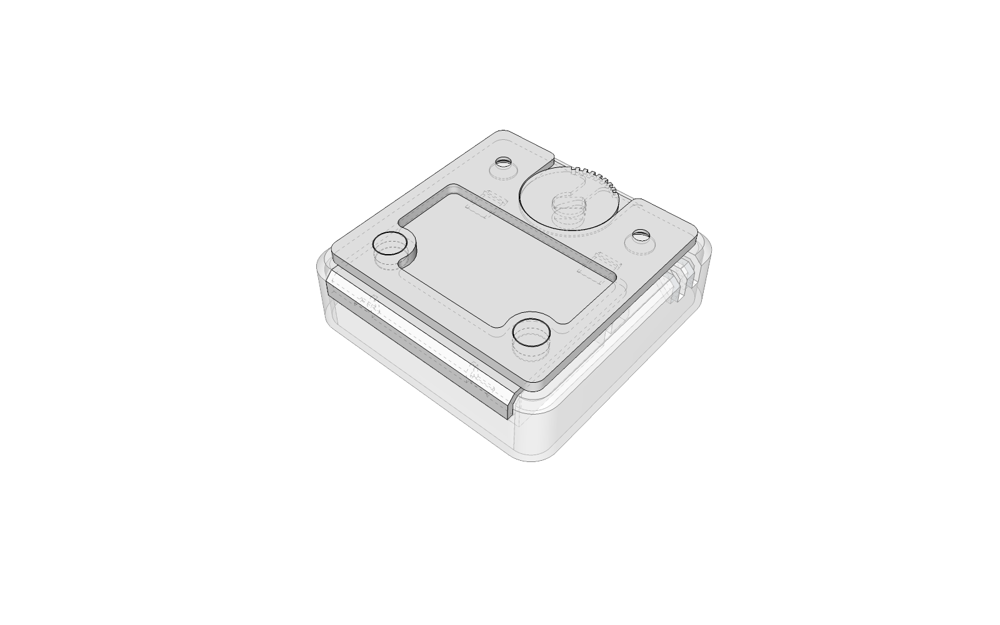
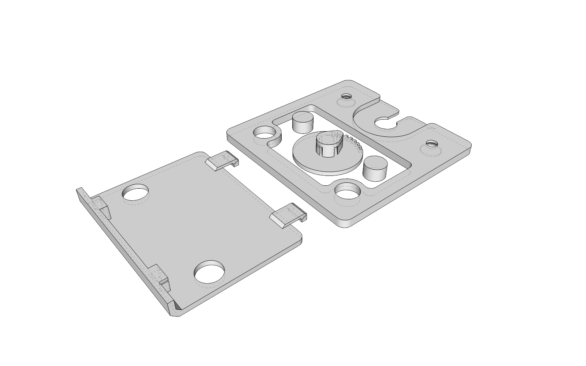
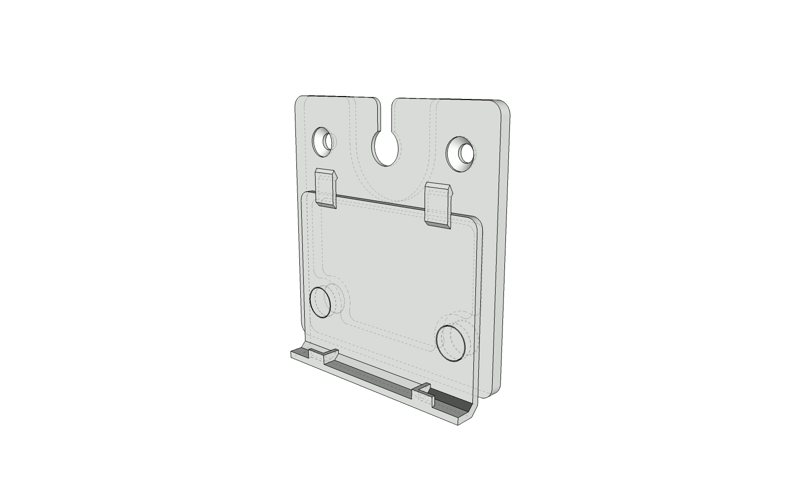

# aranet-proxy

This is an experiment to create a non-visible theft protecting wall mount for the Aranet 4 CO₂ Monitor.

- 3D-print the parts from [aranet_secure.stl](aranet_secure.stl), use sandpaper and file to remove supports from the battery lid and to make it fit the Aranet 4 housing

- Align battery lid and wall mount plate like below, optionally use glue and mount to wall
- Insert the locking pin into the Aranet 4 housing, twist ~45deg so it can slide on the mount
- Slide the Aranet 4 with the locking pin onto the mount
- Rotate the locking pin ~90deg

-