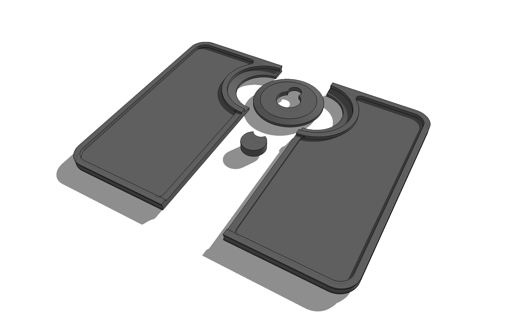
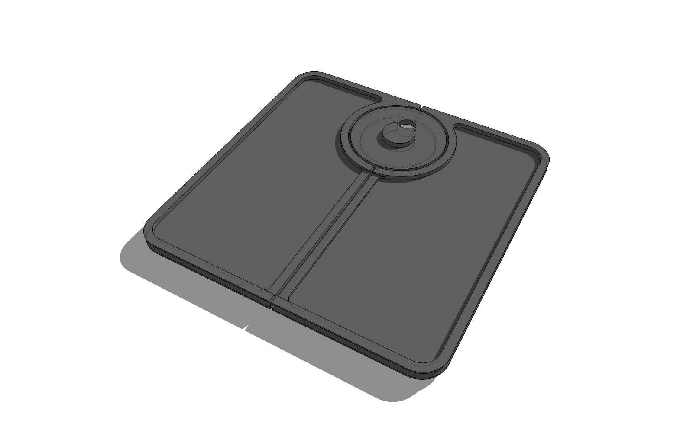
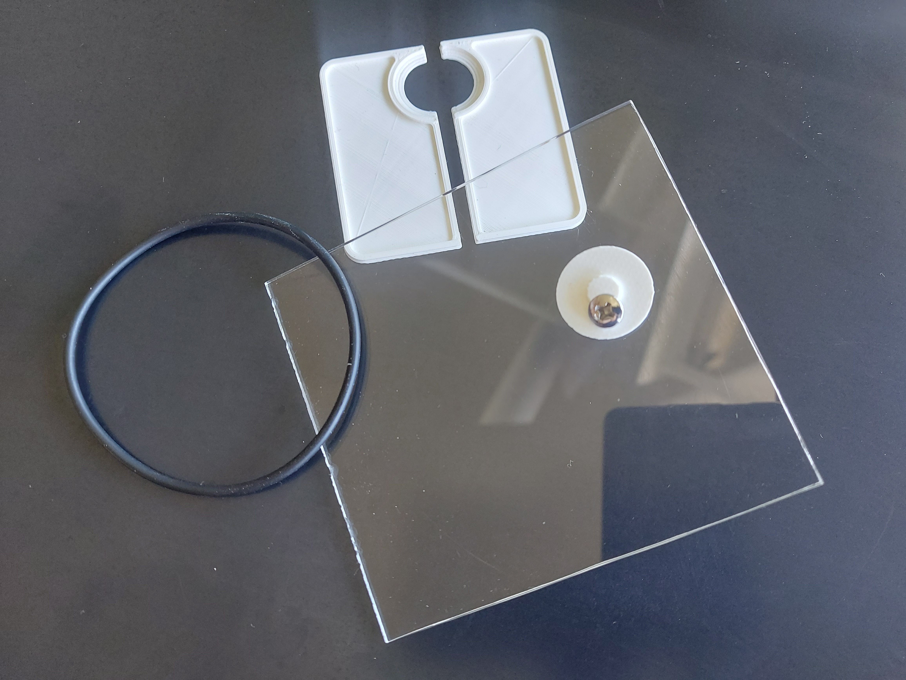
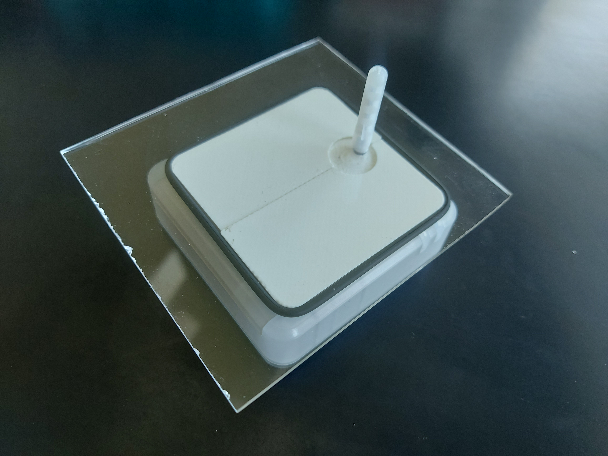
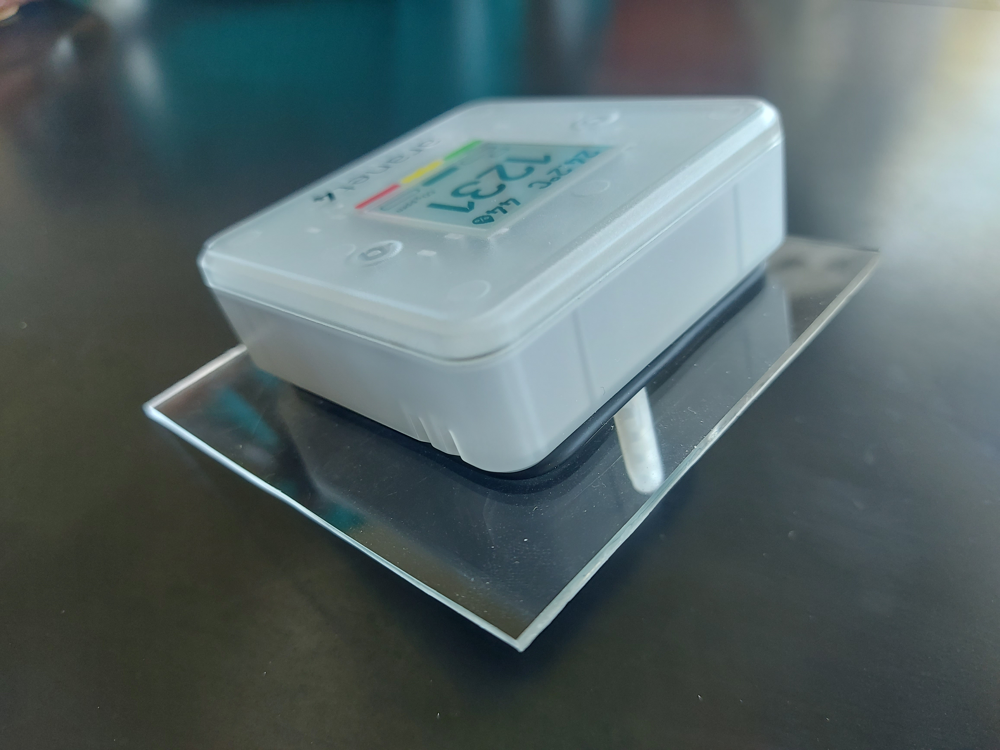

# aranet-proxy

This is an exeriment to create a non-visible theft protecting wall mount for the Aranet 4 CO₂ Monitor.

- 3D-print the parts from [aranet_secure.stl](aranet_secure.stl)

- Glue the small, moon shaped, part into the round plate like below

- Use a flat headed screw to mount the round plate at your desired location

- Slide the white parts underneath (some adjustment may be needed until the plates have a tight fit). Use a rubber band, O-ring or zip tie to keep the white plates in place.

- When done right, the Aranet will not be unmountable (with reasonable force).

- To unmount, remove the rubber band, then the white plates. Wiggle the device a bit until the round plate comes losse, then remove the device from the mount.